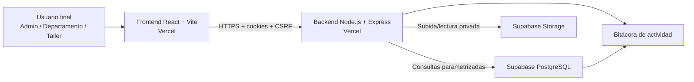
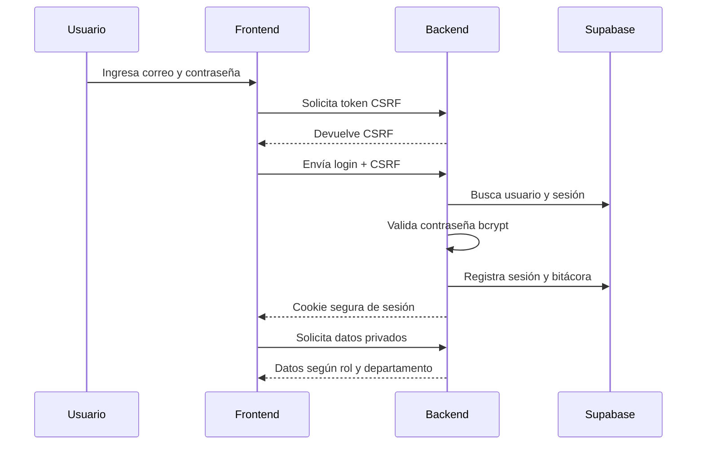
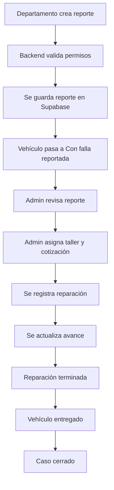
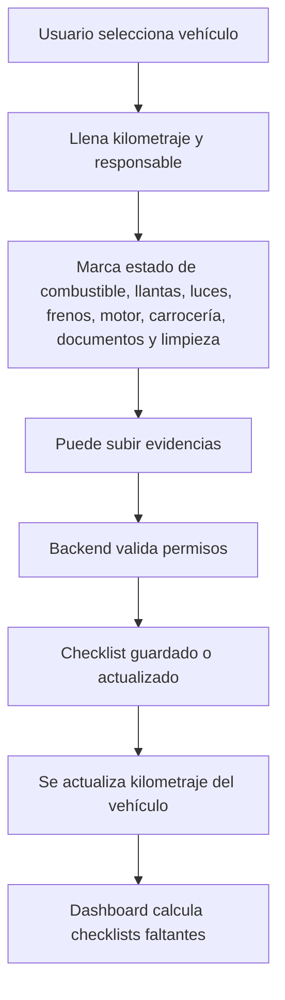
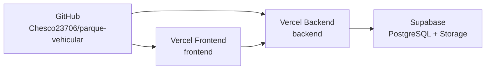

# Documentación preliminar - Parque Vehicular Izamal

## 1. Descripción general

Parque Vehicular Izamal es una plataforma web para gestionar vehículos oficiales por departamento. Permite controlar inventario vehicular, reportes de fallas, reparaciones, talleres, checklist diario, presupuesto, usuarios, historial y exportaciones.

El sistema está diseñado para que cada departamento vea únicamente sus unidades, mientras que el administrador general puede supervisar toda la operación.

## 2. Arquitectura actual



## 3. Componentes principales

### Frontend

- React con Vite.
- Interfaz responsiva.
- Login.
- Dashboard.
- Gestión de vehículos.
- Reportes de fallas.
- Checklist diario.
- Reparaciones.
- Presupuesto.
- Historial.
- Usuarios y accesos.
- Exportación de archivos.

El frontend consume la API mediante la variable:

```txt
VITE_API_URL=https://parque-vehicular-backend.vercel.app/api
```

### Backend

- Node.js con Express.
- Autenticación propia.
- Sesiones por cookie segura.
- Validación con Zod.
- Consultas parametrizadas a PostgreSQL.
- Middleware de autenticación y autorización.
- Control de permisos por rol y departamento.
- Subida de archivos a Supabase Storage.
- Bitácora de actividad.

### Base de datos

La base de datos está en Supabase PostgreSQL. Tablas principales:

- `usuarios`
- `roles`
- `departamentos`
- `vehiculos`
- `reportes_fallas`
- `evidencias_reportes`
- `talleres`
- `asignaciones_taller`
- `seguimiento_reportes`
- `checklist_diario`
- `evidencias_checklist`
- `historial_estatus`
- `bitacora_actividad`
- `reparaciones`
- `presupuesto_config`
- `sesiones`
- `password_reset_tokens`
- `email_verification_tokens`

### Almacenamiento de archivos

Supabase Storage usa buckets privados para:

- `evidencias-reportes`
- `evidencias-checklist`
- `cotizaciones`
- `reparaciones`
- `respaldos`

## 4. Roles del sistema

```mermaid
flowchart TD
  A["Administrador / Parque Vehicular"] --> A1["Ver todos los departamentos"]
  A --> A2["Crear, editar y eliminar vehículos"]
  A --> A3["Gestionar reportes y reparaciones"]
  A --> A4["Asignar talleres"]
  A --> A5["Administrar usuarios"]
  A --> A6["Consultar historial y presupuesto"]

  D["Usuario de departamento"] --> D1["Ver solo sus vehículos"]
  D --> D2["Crear reportes de falla"]
  D --> D3["Llenar checklist diario"]
  D --> D4["Consultar estatus e historial propio"]

  T["Taller / reparación"] --> T1["Ver unidades asignadas"]
  T --> T2["Actualizar avances"]
  T --> T3["Subir evidencias"]
```



## 5. Flujo de autenticación



## 6. Flujo de reportes de falla



Estados del flujo:

1. Reporte recibido
2. En revisión por Parque Vehicular
3. Taller asignado
4. En diagnóstico
5. Reparación en proceso
6. Reparación terminada
7. Vehículo entregado
8. Caso cerrado

## 7. Flujo de checklist diario



## 8. Presupuesto

El sistema maneja un presupuesto base configurable. Actualmente permite:

- Ver presupuesto asignado.
- Ver presupuesto gastado.
- Ver presupuesto disponible.
- Registrar costos de cotización.
- Descontar gastos relacionados con asignaciones de taller y reparaciones.

## 9. Seguridad actual

Medidas implementadas:

- Contraseñas cifradas con bcrypt.
- Sesiones con cookies `HttpOnly`.
- Cookies `Secure` en producción.
- `SameSite=None` para compatibilidad frontend/backend en Vercel.
- Token CSRF.
- CORS restringido al frontend autorizado.
- Rate limiting.
- Bloqueo por intentos fallidos.
- Validación backend con Zod.
- Consultas parametrizadas contra PostgreSQL.
- Separación de permisos por rol.
- Filtro de datos por departamento en backend.
- Helmet y cabeceras de seguridad.
- Bitácora de actividad.
- Restricción de extensiones y MIME type en archivos.
- Límite de tamaño de archivos.
- Supabase Storage privado.
- Preparado para RLS como bloqueo de acceso directo.

## 10. Despliegue actual



Proyectos sugeridos:

- Backend: `parque-vehicular-backend`
- Frontend: `parque-vehicular-frontend`

Variables principales del backend:

```txt
NODE_ENV=production
DATABASE_URL=...
DATABASE_SSL=true
SUPABASE_URL=...
SUPABASE_SERVICE_ROLE_KEY=...
JWT_SECRET=...
FRONTEND_ORIGIN=https://parque-vehicular-frontend.vercel.app
FRONTEND_ORIGINS=https://parque-vehicular-frontend.vercel.app
COOKIE_SECURE=true
REQUIRE_HTTPS=true
SESSION_MINUTES=30
MAX_UPLOAD_MB=25
PASSWORD_RESET_MINUTES=20
```

Variable principal del frontend:

```txt
VITE_API_URL=https://parque-vehicular-backend.vercel.app/api
```

## 11. Funcionalidades actuales

### Administración

- Login seguro.
- Dashboard general.
- Gestión de vehículos.
- Alta, edición y eliminación de vehículos.
- Gestión de usuarios.
- Reportes de fallas.
- Seguimiento por etapas.
- Asignación de taller.
- Cotización y evidencia.
- Reparaciones.
- Presupuesto.
- Historial de movimientos.
- Exportación Excel/PDF/ZIP mensual.

### Departamentos

- Acceso individual por departamento.
- Consulta de vehículos propios.
- Reporte de fallas.
- Subida de evidencias.
- Checklist diario.
- Consulta de historial permitido.

### Taller

- Visualización de unidades asignadas.
- Actualización de avances.
- Subida de evidencias.

## 12. Recomendaciones pendientes

Para fortalecer antes de venta o producción oficial:

- Agregar Cloudflare Turnstile o reCAPTCHA.
- Activar MFA obligatorio para administradores.
- Rotar claves expuestas durante configuración.
- Revisar RLS final por políticas.
- Configurar backups automáticos.
- Configurar dominio propio.
- Agregar monitoreo de errores.
- Hacer prueba de carga.
- Hacer pentesting básico.
- Crear manual de usuario final con capturas.

## 13. Estado actual

El sistema ya está preparado para trabajar con:

- GitHub como repositorio.
- Vercel para frontend y backend.
- Supabase para base de datos y archivos.
- Roles y permisos por departamento.
- Seguridad base para demo pública y uso inicial controlado.
